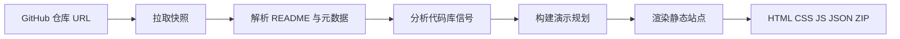

# SilentForge

[](LICENSE)
[](https://www.npmjs.com/package/silentforge)
[](https://nodejs.org/)
[](https://ingeniousfrog.github.io/SilentForge/)

**将公开 GitHub 仓库转化为可离线部署、以事实为依据的静态演示站点。**

SilentForge 读取 README、元数据、文件树、Release 与轻量代码信号，输出可预览、打包 ZIP、任意静态托管的自包含 HTML。可从 **[npm](https://www.npmjs.com/package/silentforge)** 安装（`npm install -g silentforge`），或用 **`npx silentforge`** 免安装试用。提供 **`reposite` / `silentforge` CLI** 一次性生成，或本地 **Workbench** 交互预览与 GitHub Pages 部署。

流水线**确定且以仓库事实为准**——无证据的章节自动省略。可选 **Codex**（优先）或 **OpenAI** 规划可调整章节顺序，但每条信息必须能回溯到已提取数据。

[English](./README.md) · **[在线演示](https://ingeniousfrog.github.io/SilentForge/)** — 每次 push 到 `main` 后由本 README 自动生成的滚动叙事展示站

---

## 截图

| Workbench | 预览与导出 | 部署 |
|-----------|------------|------|
| 粘贴仓库 URL，调整输出设置，本地生成。 | 流式进度、诊断、站点预览、ZIP 下载。 | 复制 GitHub Pages workflow，从仓库发布。 |
|  |  |  |

---

## 目录

- [产品概览](#产品概览)
- [快速开始](#快速开始)
- [用法](#用法)
- [示例](#示例)
- [工作原理](#工作原理)
- [功能特性](#功能特性)
- [环境要求](#环境要求)
- [安装与分发](#安装与分发)
- [部署到 GitHub Pages](#部署到-github-pages)
- [GitHub 认证](#github-认证可选)
- [Workbench](#workbench)
- [CLI 参考](#cli-参考)
- [生成产物](#生成产物)
- [演示模式与主题](#演示模式与主题)
- [国际化说明](#国际化说明)
- [环境变量](#环境变量)
- [设计保证](#设计保证)
- [FAQ](#faq)
- [开发指南](#开发指南)
- [许可证](#许可证)

---

## 产品概览

SilentForge 面向需要**可信、可离线传播的项目叙事**，又不想搭建文档平台或从零手写落地页的维护者与团队。

| 入口 | 用途 |
|------|------|
| **`reposite init`** | 命令行一次性生成至本地目录 |
| **Workbench** | 本地 Web 界面：任务流、诊断、预览、ZIP 导出 |
| **生成站点** | 纯 HTML / CSS / JS / JSON，可编辑、可任意托管 |

两种入口共用同一套生成引擎，Preview、ZIP 下载与 CLI 产物在结构上一致。

典型生成站点包含 **Hero**、**特性**、**视觉素材**、**用法命令**、README 深度章节、**技术栈**、**架构图**与**资源链接**。可浏览[在线演示](https://ingeniousfrog.github.io/SilentForge/)查看本仓库的完整渲染效果。

---

## 快速开始

需要 **Node.js 20+**。任选一种安装方式：

| 方式 | 适用场景 |
|------|----------|
| **`npx silentforge`** | 试用一次，无需安装 |
| **`npm install -g silentforge`** | 日常使用 `reposite` / `silentforge` |
| **[从源码构建](#从源码构建)** | 参与开发或跑未发布提交 |

```sh
# 生成静态演示站点（npx — 无需安装）
npx silentforge init vercel/next.js

# 打开生成的 index.html（macOS 示例）
open vercel/next.js-site/index.html

# 启动本地 Workbench
npx silentforge web
```

生成后可选本地预览：

```sh
npx --yes serve "vercel/next.js-site"
```

---

## 用法

[快速开始](#快速开始) 之后的常见流程：

```sh
# CLI — 生成到目录并本地打开
npx silentforge init owner/repo
open owner/repo-site/index.html    # macOS；Linux/Windows 请调整路径

# Workbench — 交互预览、诊断、ZIP、部署指南
npx silentforge web
# → http://127.0.0.1:4177/

# 自定义输出目录与语言
npx silentforge init owner/repo -o my-site --locale zh

# 可选 AI 辅助章节排序（优先本机 Codex 登录；OPENAI_API_KEY 为备选）
codex login   # 使用本地 Codex 时先登录一次
npx silentforge init owner/repo --ai
OPENAI_API_KEY=sk-… npx silentforge init owner/repo --ai
```

**发布到 GitHub Pages：** 在 Workbench 生成后打开 **Deploy**，复制 workflow YAML 到 `.github/workflows/silentforge-pages.yml`，在 **Settings → Pages → GitHub Actions** 启用后 push 到 `main`。详见 [部署到 GitHub Pages](#部署到-github-pages)。

---

## 示例

可在文档完善的公开仓库上试用 SilentForge：

| 仓库 | 适用场景 | 命令 |
|------|----------|------|
| [openai/openai-node](https://github.com/openai/openai-node) | 开发者文档（安装 + 用法） | `npx silentforge init openai/openai-node` |
| [vercel/next.js](https://github.com/vercel/next.js) | 大型 monorepo 架构信号 | `npx silentforge init vercel/next.js` |
| [tailwindlabs/tailwindcss](https://github.com/tailwindlabs/tailwindcss) | 视觉 README 内容 | `npx silentforge init tailwindlabs/tailwindcss` |
| [axios/axios](https://github.com/axios/axios) | 精简库叙事 | `npx silentforge init axios/axios` |
| [microsoft/playwright](https://github.com/microsoft/playwright) | 文档密集 + Release | `npx silentforge init microsoft/playwright` |

详见 [examples/README.md](./examples/README.md)。

**在线演示：** [SilentForge GitHub Pages 展示站](https://ingeniousfrog.github.io/SilentForge/) — **已上线**，每次 push 到 `main` 自动更新（[workflow](./.github/workflows/silentforge-pages.yml)）。可先打开演示站预览滚动章节、提取的命令与架构信号，再为自己的仓库部署。

---

## 工作原理



1. **采集** — 解析 `owner/repo`，通过 GitHub API 获取元数据、README、Release 与文件树。
2. **提取** — 结构化解析 README（特性、安装、用法、FAQ、截图、章节），并生成轻量代码百科（技术栈、入口文件、配置、模块地图、Mermaid 图）。
3. **诊断** — 评估仓库就绪度，在发布前给出评分、短板与改进建议。
4. **规划** — 选择演示模式、主题与章节（默认规则引擎；可选 Codex 或 OpenAI，带 Schema 校验）。
5. **输出** — 写入自包含静态站点：滚动叙事主页、详情页、内置 Mermaid 运行时（无需 CDN）。

---

## 功能特性

- **滚动叙事演示站** — 粘性章节导航、详情路由、三种主题（Dark Signal、Editorial Light、Blueprint）、五种叙事模式或根据仓库信号自动选择
- **代码百科** — 技术栈、入口文件、配置信号、目录摘要、模块地图及离线 Mermaid 架构图
- **仓库诊断** — 就绪度评分、优势/缺口/建议，展示于 Workbench **Overview**
- **本地 Workbench** — 粘贴 URL、SSE 任务流、**Overview / Resources / Code Wiki / Preview** 四 Tab、ZIP 下载、**Deploy** 复制 GitHub Pages workflow；**Settings** 弹窗配置模式、主题、章节与 Codex 优先 AI
- **以仓库为准的输出** — 纯 HTML / CSS / JS / JSON，消费侧无需构建；Preview 与 ZIP 文件一致
- **国际化** — Workbench 与生成站点界面支持 EN / 中文；仓库事实保持源语言

---

## 环境要求

| 项目 | 说明 |
|------|------|
| **Node.js 20+** | CLI 与 Workbench 均需 |
| **公开 GitHub 仓库** | `https://github.com/owner/repo` 或 `owner/repo` 简写 |
| **`GITHUB_TOKEN`** | 可选；建议配置以提高 API 限额（CLI 环境变量或 Workbench 界面填写） |
| **`codex login`** | 可选；安装并登录 Codex CLI 后，`--ai` 优先使用本地 Codex |
| **`OPENAI_API_KEY`** | 可选；AI 辅助演示规划的备选后端（`--ai` 或 Workbench 复选框） |
| **`OPENAI_BASE_URL`** | 可选；OpenAI 兼容端点（如 gpt2cursor 桥接），配合 `OPENAI_API_KEY` 使用 |

---

## 安装与分发

### npm（推荐）

已发布至 npm：[silentforge](https://www.npmjs.com/package/silentforge)。需要 **Node.js 20+**。

```sh
# 一次性生成（无需安装）
npx silentforge init owner/repo

# Workbench 界面
npx silentforge web

# 全局安装 — 将 reposite / silentforge 加入 PATH
npm install -g silentforge
reposite init owner/repo
reposite web

# 项目内安装（可选）
npm install silentforge
npx silentforge init owner/repo
```

**`npm install -g` 报 `EACCES`？** 在 macOS/Linux 上，npm 可能无权在 `/usr/local/bin` 创建符号链接。可改用 [`npx silentforge`](#快速开始)，或见下方 [全局安装权限错误](#全局安装权限错误-eacces)。

**`reposite`** 与 **`silentforge`** 命令均指向 `package.json` 中的同一 CLI 入口：

```json
"bin": { "reposite": "./dist/cli.js", "silentforge": "./dist/cli.js" }
```

### 从源码构建

```sh
git clone https://github.com/ingeniousfrog/SilentForge.git
cd SilentForge
npm install
npm run build
```

**不安装全局命令时直接运行：**

```sh
# 一次性生成站点
node dist/cli.js init openai/openai-node

# Workbench（编译产物）
node dist/cli.js web

# 开发循环（tsx 直接跑 TypeScript）
npm run dev -- init openai/openai-node
npm run web
```

**将 `reposite` 安装到 PATH：**

```sh
npm link          # 在仓库根目录、完成 npm run build 后执行
reposite --help
reposite init openai/openai-node
reposite web
```

或在 `npm run build` 之后：

```sh
npm install -g .
```

### 桌面打包（DMG / EXE）

原生安装包在规划中。在此之前，请通过**源码构建**或 **`npm link` / 全局安装**使用。未来的 DMG/EXE 将内置编译后的 `dist/` 并本地启动 `reposite web`，用户无需单独安装 Node。

### 验证安装

```sh
reposite --help
reposite web
# 浏览器打开 http://127.0.0.1:4177/
```

执行 `reposite init` 后打开输出目录中的 `index.html`，或用任意静态文件服务器托管。

---

## 部署到 GitHub Pages

SilentForge 发布的是**从目标仓库自身生成的静态展示站**——README、元数据、文件树与代码信号，而非手写营销页。[在线演示](https://ingeniousfrog.github.io/SilentForge/) 就是把本产品用在**本仓库**上的效果。

### 一次性前置条件（每个仓库都需要）

GitHub 要求**先手动启用 Pages**，Actions 的首次部署才能成功：

1. 打开仓库 **Settings → Pages → Build and deployment**。
2. 将 **Source** 设为 **GitHub Actions**（不要选 Deploy from a branch）。
3. 保存。

若跳过第 2 步，workflow 会在 `configure-pages` 报 `Get Pages site failed`，或 deploy 任务返回 **404**。启用 Pages 后，进入 **Actions**，选择 **Deploy SilentForge presentation site**，点击 **Re-run failed jobs**（或 **Run workflow**）。

### 本仓库演示站（SilentForge demo）

**已上线：** [https://ingeniousfrog.github.io/SilentForge/](https://ingeniousfrog.github.io/SilentForge/)

[`.github/workflows/silentforge-pages.yml`](./.github/workflows/silentforge-pages.yml) 已提交。每次 push 到 `main` 会：

1. 检出代码并执行 `npm ci && npm run build`。
2. 为 `${{ github.repository }}` 生成展示站到 `site/`。
3. 将 `site/` 发布到 GitHub Pages。

**首次配置**（仅 fork 或克隆到新仓库、尚未启用 Pages 时需要）：

1. 启用 Pages：[Settings → Pages](https://github.com/ingeniousfrog/SilentForge/settings/pages) → **Source: GitHub Actions**。
2. 在 [Actions](https://github.com/ingeniousfrog/SilentForge/actions/workflows/silentforge-pages.yml) 中运行 **Deploy SilentForge presentation site**。

首次部署成功后，之后 push 到 `main` 会自动重新生成并发布。

### 其他仓库

1. 完成上述[一次性前置条件](#一次性前置条件每个仓库都需要)。
2. 将 [`.github/workflows/silentforge-pages.yml`](./.github/workflows/silentforge-pages.yml) 复制到你的仓库——或在本地 Workbench 生成后，打开 **Deploy** 复制 workflow YAML。
3. push 到 `main`，或在 **Actions** 中手动运行。

其他仓库请使用 Workbench **Deploy** 提供的 workflow 模板：`npx --yes silentforge@latest init ${{ github.repository }} -o site --locale en`（需要 npm 上的 **silentforge >= 0.1.1**）。本仓库从源码 `npm ci && npm run build`，确保 CI 与最新提交一致。

线上地址格式：`https://<user>.github.io/<repo>/`（组织仓库路径相同）。

Pages 上线后，可在 README 中添加 badge（Workbench Overview 也可一键复制）：

```markdown
[](https://YOUR_USER.github.io/YOUR_REPO/)
```

---

## GitHub 认证（可选）

SilentForge 通过 **GitHub REST API** 读取公开仓库数据（元数据、README、Release、文件树）。认证可选但建议配置：未认证请求共享较低的小时限额（约 60 次/小时/IP）；携带 Token 可显著提高（约 5000 次/小时）。

Token **仅**用于请求 `api.github.com`，不会发送给 OpenAI 或其他第三方。

| 方式 | 场景 | 用法 |
|------|------|------|
| **Workbench 界面** | 浏览器 → 本机 Workbench 服务 | 展开 **GitHub 访问（可选）**，粘贴 [Personal Access Token](https://github.com/settings/tokens)，可选勾选 **在此设备上记住** |
| **`GITHUB_TOKEN` 环境变量** | CLI 与 Workbench 服务端回退 | 在运行 `reposite init` 或 `reposite web` 前 `export GITHUB_TOKEN=ghp_…` |
| **`--token` 参数** | 仅 CLI | `reposite init owner/repo --token ghp_…` |

**Workbench 行为说明：**

- Token 随生成任务提交至**本机**服务（`POST /api/jobs`）。
- 仅保存在该任务的内存中，**不会**通过任务状态 API 返回给前端。
- 勾选 **在此设备上记住** 后，Token 写入浏览器 `localStorage`（`silentforge.githubToken`），便于个人电脑与未来桌面版使用。
- 若界面留空，服务端回退使用启动 Workbench 时的 `process.env.GITHUB_TOKEN`。

公开仓库通常使用经典 PAT 的默认公开读权限即可。细粒度 Token 需对目标仓库授予 **Contents: 只读** 与 **Metadata: 只读**。

---

## Workbench

从源码启动：

```sh
npm run web
```

访问 [http://127.0.0.1:4177/](http://127.0.0.1:4177/)

自定义地址或端口：

```sh
npm run web -- --host 127.0.0.1 --port 4188
```

使用编译后的 CLI 入口：

```sh
npm run build && npm run web:dist
```

### 使用流程

1. **外观** — 顶栏切换 **Dark / Light**（默认跟随系统；手动选择后写入 `silentforge.uiTheme`）。
2. **语言** — 切换 **EN / 中文**（写入 `silentforge.locale`；影响 Workbench 文案与下一次生成任务）。
3. **GitHub Token（可选）** — 若频繁生成或遇到限流，展开 **GitHub 访问（可选）** 填写 Token。详见 [GitHub 认证](#github-认证可选)。
4. **Settings** — 打开 **Settings** 弹窗配置输出模式、主题、章节，以及可选 **AI-assisted structure**（Codex 状态徽章、OpenAI Key/Base URL 供服务端任务使用）。点击 **Generate** 时会自动保存设置。
5. **目标** — 粘贴公开 GitHub URL 或 `owner/repo`，点击 **Generate**。
6. **检视** — 跟踪生成流；查看 **Overview**、**Resources**、**Code Wiki**、**Preview**（完成后自动打开）。
7. **导出** — 从 Tab 栏下载 ZIP、打开 **Deploy** 查看 GitHub Pages 步骤，或 **Back to home** 开始新任务。

### 输出设置

Workbench **Settings → Output settings** 仅控制**生成站点**，不改变 Workbench 自身外观：

| 控件 | 作用 |
|------|------|
| **Mode** | 叙事结构（`auto`、开发者文档、架构交接、视觉展示、精简叙事） |
| **Theme** | 生成页面配色（`auto`、Dark Signal、Editorial Light、Blueprint） |
| **Chapters** | 当仓库有对应内容时，是否包含各章节类型 |

勾选 **AI-assisted structure** 会优先使用本机已登录的 Codex 编排提取的仓库数据；若未登录 Codex 且设置了 `OPENAI_API_KEY`，则使用 OpenAI。事实仍受源数据约束；失败或校验不通过时回退本地规则。

---

## CLI 参考

### `reposite init <github-repo-url>`

从仓库生成静态演示站点。

```sh
reposite init https://github.com/openai/openai-node
reposite init openai/openai-node
```

| 选项 | 说明 |
|------|------|
| `-o, --output <dir>` | 输出目录（默认：`<repo-name>-site`） |
| `--ai` | 启用 AI 辅助结构（本机 Codex 登录优先，OpenAI 环境变量备选，失败回退本地规则） |
| `--mode <mode>` | `auto`、`developer-deck`、`architecture-map`、`visual-showcase`、`compact-story` |
| `--theme <theme>` | `auto`、`signal-dark`、`editorial-light`、`blueprint` |
| `--chapters <kinds>` | 逗号分隔的章节类型（见[演示模式与主题](#演示模式与主题)） |
| `--locale <locale>` | 生成站点 UI 语言：`en`（默认）或 `zh` |
| `--token <token>` | GitHub Token（可回退到 `GITHUB_TOKEN`） |

示例：

```sh
# AI 辅助规划（`codex login` 后优先使用 Codex）
reposite init openai/openai-node --ai

# OpenAI API 备选
OPENAI_API_KEY=your_key reposite init openai/openai-node --ai

# gpt2cursor 兼容桥接
OPENAI_BASE_URL=http://127.0.0.1:8787/v1 OPENAI_API_KEY=g2c_… reposite init openai/openai-node --ai

# 显式指定演示选项
reposite init openai/openai-node \
  --mode developer-deck \
  --theme signal-dark \
  --chapters features,usage,architecture \
  --locale zh \
  --token "$GITHUB_TOKEN"
```

### `reposite web`

启动本地 Workbench 服务。

```sh
reposite web
reposite web --host 127.0.0.1 --port 4177
```

---

## 生成产物

`reposite init` 输出自包含目录：

| 路径 | 用途 |
|------|------|
| `index.html` | 滚动叙事主页，含粘性章节导航 |
| `assets/site.css` | 主题样式 |
| `assets/site.js` | 章节导航、阅读进度、Mermaid 启动 |
| `assets/mermaid.js` | 内置 Mermaid 运行时（可离线） |
| `details/*.html` | 安装、用法、架构、Release、README 详情页 |
| `data/site.json` | 结构化仓库模型与最终演示规划 |
| `README.md` | 如何打开或部署生成站点的简要说明 |

**内容来源**（不臆造）：

- README：标题、摘要、特性、安装/用法、FAQ、截图、链接、长章节
- GitHub 元数据：Stars、Topics、许可证、Release、默认分支、语言、主页
- 代码百科：目录结构、技术栈、入口文件、配置文件、模块地图、Mermaid 图
- 就绪度诊断（Workbench Overview 同步展示）

---

## 演示模式与主题

### 模式

| 模式 | 适用场景 |
|------|----------|
| `auto` | 根据 README、截图与代码库信号自动推断 |
| `developer-deck` | 侧重安装与用法的 API/库项目 |
| `architecture-map` | 结构或模块信号较强的系统 |
| `visual-showcase` | README 含截图与视觉内容的项目 |
| `compact-story` | 小型或早期仓库的精简叙事 |

### 生成站点主题

| 主题 ID | 名称 | 风格 |
|---------|------|------|
| `signal-dark` | Dark Signal | 默认深色开发者工具风 |
| `editorial-light` | Editorial Light | 浅色编辑排版，标题使用衬线字体 |
| `blueprint` | Blueprint | 工程网格背景 |

在 Workbench **Output settings** 或 CLI `--theme` 中指定。`auto` 跟随所选演示模式。

### 章节类型

`features`、`visuals`、`usage`、`readme-insights`、`technology`、`architecture`、`resources`

Hero 章节始终保留。已启用但仓库无对应内容的章节会被省略。

---

## 国际化说明

| 范围 | 是否本地化 | 机制 |
|------|------------|------|
| Workbench 界面 | 是 — EN / 中文 | 顶栏语言胶囊（`silentforge.locale`） |
| Workbench 外观 | 是 — Dark / Light | 顶栏主题胶囊（`silentforge.uiTheme`；未手动选择前跟随系统） |
| 生成站点框架 | 是 — 导航、标签、页脚、诊断文案 | `--locale` / 生成时的 Workbench 语言 |
| README 与仓库事实 | **否** | 始终按源仓库原文展示 |

切换 Workbench 语言不会追溯翻译历史任务日志，只影响当前界面与下一次生成。

---

## 环境变量

| 变量 | 用途 |
|------|------|
| `GITHUB_TOKEN` | Workbench 界面未填 Token 时的服务端回退，或 CLI 未传 `--token` 时使用 |
| `CODEX_PATH` | 可选，指定 Codex CLI 二进制路径 |
| `CODEX_MODEL` | 可选，Codex 模型覆盖（`-m`） |
| `OPENAI_API_KEY` | 可选 AI 演示规划备选（`--ai` 或 Workbench 复选框） |
| `OPENAI_BASE_URL` | 可选 OpenAI 兼容端点（如 gpt2cursor 桥接） |
| `OPENAI_MODEL` | 覆盖 OpenAI/Codex 模型（默认：`gpt-5.5`） |
| `SILENTFORGE_AI_TIMEOUT_MS` | AI 规划超时（毫秒；Codex 默认 `60000`，OpenAI API 默认 `15000`） |

可复制 [`.env.example`](.env.example) 作为注释模板。Windows 上通过 PTY 调用本地 Codex 需要 `node-pty`；macOS/Linux 在 PTY 不可用时可降级到 `script` 命令。

Workbench 本地偏好（浏览器 `localStorage`，非环境变量）：`silentforge.locale`、`silentforge.uiTheme`、`silentforge.githubToken`（勾选「在此设备上记住」时）。

---

## 设计保证

| 原则 | 行为 |
|------|------|
| **以仓库为准** | 每条信息可回溯至已提取的仓库数据 |
| **不留占位** | 无内容章节直接省略，不填充样板文案 |
| **产物可编辑** | 纯 HTML / CSS / JS / JSON，无专有运行时 |
| **预览即产物** | Preview、ZIP 与 CLI 输出文件一致 |
| **本地优先** | CLI 与 Workbench 在本机运行；GitHub Pages 为可选发布目标 |
| **AI 优雅降级** | Codex/OpenAI 不可用或校验失败时回退规则引擎 |

---

## FAQ

### 必须填 GitHub Token 吗？

公开仓库偶尔试用不必填。[Personal Access Token](https://github.com/settings/tokens) 可在触发 API 限流时使用（未认证约 60 次/小时/IP，认证后约 5000 次/小时）。

### 全局安装权限错误（`EACCES`）

若 `npm install -g silentforge` 报错 `EACCES: permission denied, symlink ... -> /usr/local/bin/reposite`，说明 npm 无法在系统目录写入全局命令链接。这在 macOS 上很常见——不是 SilentForge 包的问题。

**最省事：** 不做全局安装，直接用 `npx silentforge init …` 或 `npx silentforge web`（见[快速开始](#快速开始)）。

**日常推荐：** 将 npm 全局目录设为用户目录：

```sh
mkdir -p ~/.npm-global
npm config set prefix ~/.npm-global
# 写入 ~/.zshrc 或 ~/.bashrc：
export PATH="$HOME/.npm-global/bin:$PATH"
```

然后重新执行 `npm install -g silentforge`。使用 **nvm**、**fnm** 或 **volta** 管理 Node 时，通常也不会遇到 `/usr/local` 权限问题。

除非清楚权限后果，否则不建议 `sudo npm install -g`。

### 在线演示是 SilentForge 官网吗？

不是——这是 SilentForge **对本仓库自动生成的展示站**，用于预览输出质量与章节布局，并非单独官网。Fork 或全新克隆的仓库仍需完成[一次性 Pages 配置](#一次性前置条件每个仓库都需要)。

### 只能部署 GitHub Pages 吗？

不是。可下载 ZIP 或上传输出目录到 Vercel、Cloudflare Pages、Netlify 等任意静态托管；Workbench **Deploy** 提供可复制命令。

### 支持私有仓库吗？

当前版本面向**公开**仓库；私有仓库支持在规划中。

### 会编造 README 里没有的功能吗？

不会。无仓库证据的章节会省略；可选 AI 仅调整章节顺序且须引用已提取信号，失败时回退本地规则。

---

## 开发指南

```sh
npm test                 # 单元测试
npm run test:coverage    # 覆盖率报告
npm run dev -- init owner/repo   # 通过 tsx 运行 CLI
npm run web              # 通过 tsx 启动 Workbench
```

项目结构（节选）：

```
src/
  analyzer/       代码库信号提取
  commands/       CLI init 命令
  github/         仓库快照拉取
  i18n/           中英文文案目录
  presentation/   演示规划（规则 + 可选 Codex/OpenAI）
  readme/         README 解析
  site/           静态站点生成
  workbench/      本地服务、任务存储、UI
```

---

## 许可证

Apache-2.0 — 见 [LICENSE](./LICENSE)。
