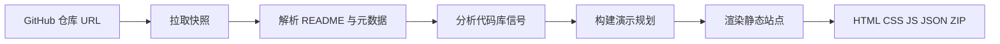

# SilentForge

**将公开 GitHub 仓库转化为可离线部署、以事实为依据的静态演示站点。**

SilentForge 是一套本地优先工具链：读取仓库中的 README、元数据、文件树、Release 及轻量代码分析信号，输出可预览、可编辑、可打包 ZIP、可部署到任意静态托管的自包含 HTML 产物。项目以 `reposite` CLI 与浏览器 **Workbench** 两种形态交付。

默认流水线**确定且以仓库事实为准**：只呈现仓库中真实存在的内容，无证据的章节自动省略。可选的 OpenAI 辅助规划可调整叙事顺序，但每条信息必须能回溯到已提取的仓库数据；失败时回退至本地规则引擎。

[English](./README.md)

---

## 目录

- [快速开始](#快速开始)
- [示例](#示例)
- [产品概览](#产品概览)
- [工作原理](#工作原理)
- [核心能力](#核心能力)
- [环境要求](#环境要求)
- [安装与分发](#安装与分发)
- [GitHub 认证](#github-认证可选)
- [Workbench](#workbench)
- [CLI 参考](#cli-参考)
- [生成产物](#生成产物)
- [演示模式与主题](#演示模式与主题)
- [国际化说明](#国际化说明)
- [环境变量](#环境变量)
- [设计保证](#设计保证)
- [开发指南](#开发指南)
- [许可证](#许可证)

---

## 产品概览

SilentForge 面向需要**可信、可离线传播的项目叙事**，又不想搭建文档平台或从零手写落地页的维护者与团队。

| 入口 | 用途 |
|------|------|
| **`reposite init`** | 命令行一次性生成至本地目录 |
| **Workbench** | 本地 Web 界面：任务流、诊断、预览、ZIP 导出 |
| **生成站点** | 纯 HTML / CSS / JS / JSON，可编辑、可任意托管 |

两种入口共用同一套生成引擎，Preview、ZIP 下载与 CLI 产物在结构上一致。

---

## 快速开始

需要 **Node.js 20+**，无需安装：

```sh
# 生成静态演示站点
npx silentforge init vercel/next.js

# 打开生成的 index.html（macOS 示例）
open vercel/next.js-site/index.html

# 启动本地 Workbench
npx silentforge web
```

生成后可选本地预览：

```sh
npx --yes serve "vercel/next.js-site"
```

---

## 示例

可在文档完善的公开仓库上试用 SilentForge：

| 仓库 | 适用场景 | 命令 |
|------|----------|------|
| [openai/openai-node](https://github.com/openai/openai-node) | 开发者文档（安装 + 用法） | `npx silentforge init openai/openai-node` |
| [vercel/next.js](https://github.com/vercel/next.js) | 大型 monorepo 架构信号 | `npx silentforge init vercel/next.js` |
| [tailwindlabs/tailwindcss](https://github.com/tailwindlabs/tailwindcss) | 视觉 README 内容 | `npx silentforge init tailwindlabs/tailwindcss` |
| [axios/axios](https://github.com/axios/axios) | 精简库叙事 | `npx silentforge init axios/axios` |
| [microsoft/playwright](https://github.com/microsoft/playwright) | 文档密集 + Release | `npx silentforge init microsoft/playwright` |

详见 [examples/README.md](./examples/README.md)。

**在线演示：** [SilentForge GitHub Pages 展示站](https://ingeniousfrog.github.io/SilentForge/) — 由本仓库通过 [`.github/workflows/silentforge-pages.yml`](./.github/workflows/silentforge-pages.yml) 自动生成。

---

## 工作原理



1. **采集** — 解析 `owner/repo`，通过 GitHub API 获取元数据、README、Release 与文件树。
2. **提取** — 结构化解析 README（特性、安装、用法、FAQ、截图、章节），并生成轻量代码百科（技术栈、入口文件、配置、模块地图、Mermaid 图）。
3. **诊断** — 评估仓库就绪度，在发布前给出评分、短板与改进建议。
4. **规划** — 选择演示模式、主题与章节（默认规则引擎；可选 OpenAI，带 Schema 校验）。
5. **输出** — 写入自包含静态站点：滚动叙事主页、详情页、内置 Mermaid 运行时（无需 CDN）。

---

## 核心能力

### 演示层

- 带粘性章节导航与详情路由的滚动叙事 `index.html`
- 三种生成站点视觉主题：Dark Signal、Editorial Light、Blueprint
- 五种叙事模式：开发者文档、架构交接、视觉展示、精简叙事，或根据仓库信号自动选择
- 可配置章节开关；无内容的章节自动跳过

### 代码百科

- 技术栈、入口文件与配置文件信号检测
- 目录摘要、模块地图及本地渲染的 Mermaid 架构图
- 检测结论均来自仓库信号，不臆造框架或结构

### 仓库诊断

- 就绪度评分，以及分级优势、缺口与可执行建议
- 在 Workbench **Overview** 面板展示

### Workbench

- 搜索优先界面：粘贴 URL、SSE 实时任务流、四 Tab 结果检视
- **Overview** — 诊断与摘要指标
- **Resources** — 解析后的 README、元数据与原始信号
- **Code Wiki** — 代码库分析结果
- **Preview** — 生成站点 iframe 预览；完成后自动打开
- ZIP 下载与 Preview 完全一致
- EN / 中文语言胶囊；Dark / Light 外观切换（未手动选择前默认跟随系统 `prefers-color-scheme`）

### 产物约定

- 消费侧无需构建步骤——直接打开 `index.html` 或上传目录
- Preview 与 ZIP 始终指向同一套文件
- 输出目录内的 README 说明部署方式

---

## 环境要求

| 项目 | 说明 |
|------|------|
| **Node.js 20+** | CLI 与 Workbench 均需 |
| **公开 GitHub 仓库** | `https://github.com/owner/repo` 或 `owner/repo` 简写 |
| **`GITHUB_TOKEN`** | 可选；建议配置以提高 API 限额（CLI 环境变量或 Workbench 界面填写） |
| **`OPENAI_API_KEY`** | 可选；启用 AI 辅助演示规划（`--ai` 或 Workbench 复选框） |

- EN / 中文语言胶囊；Dark / Light 外观切换（未手动选择前默认跟随系统 `prefers-color-scheme`）
- 可选 GitHub Personal Access Token 输入（仅存本地，提高 API 限额）

---

## 安装与分发

### npm（推荐）

```sh
# 一次性生成（无需全局安装）
npx silentforge init owner/repo

# Workbench 界面
npx silentforge web

# 全局安装
npm install -g silentforge
reposite init owner/repo
reposite web
```

**`reposite`** 与 **`silentforge`** 命令均指向 `package.json` 中的同一 CLI 入口：

```json
"bin": { "reposite": "./dist/cli.js", "silentforge": "./dist/cli.js" }
```

### 从源码构建

```sh
git clone https://github.com/ingeniousfrog/SilentForge.git
cd SilentForge
npm install
npm run build
```

**不安装全局命令时直接运行：**

```sh
# 一次性生成站点
node dist/cli.js init openai/openai-node

# Workbench（编译产物）
node dist/cli.js web

# 开发循环（tsx 直接跑 TypeScript）
npm run dev -- init openai/openai-node
npm run web
```

**将 `reposite` 安装到 PATH：**

```sh
npm link          # 在仓库根目录、完成 npm run build 后执行
reposite --help
reposite init openai/openai-node
reposite web
```

或在 `npm run build` 之后：

```sh
npm install -g .
```

### 桌面打包（DMG / EXE）

原生安装包在规划中。在此之前，请通过**源码构建**或 **`npm link` / 全局安装**使用。未来的 DMG/EXE 将内置编译后的 `dist/` 并本地启动 `reposite web`，用户无需单独安装 Node。

### 验证安装

```sh
reposite --help
reposite web
# 浏览器打开 http://127.0.0.1:4177/
```

执行 `reposite init` 后打开输出目录中的 `index.html`，或用任意静态文件服务器托管。

---

## 部署到 GitHub Pages

SilentForge 提供 GitHub Actions 工作流，在每次推送到 `main` 时重新生成并发布展示站。

1. 在仓库中进入 **Settings → Pages → Build and deployment**，将来源设为 **GitHub Actions**。
2. 将 [`.github/workflows/silentforge-pages.yml`](./.github/workflows/silentforge-pages.yml) 复制到你的仓库（或在本地 Workbench 生成后，从 Overview 使用 **复制 GitHub Pages workflow**）。
3. 推送到 `main`，或在 **Actions** 标签页手动运行工作流。

本仓库的发布地址：**https://ingeniousfrog.github.io/SilentForge/**。

其他仓库可在 workflow 中使用 `npx silentforge@latest init ${{ github.repository }} -o site`（见模板）。SilentForge 自身仓库使用 `npm ci && npm run build` 从源码构建，确保 CI 与最新提交一致。

Pages 上线后，可在 README 中添加 badge（Workbench Overview 也可一键复制）：

```markdown
[](https://YOUR_USER.github.io/YOUR_REPO/)
```

---

## GitHub 认证（可选）

SilentForge 通过 **GitHub REST API** 读取公开仓库数据（元数据、README、Release、文件树）。认证可选但建议配置：未认证请求共享较低的小时限额（约 60 次/小时/IP）；携带 Token 可显著提高（约 5000 次/小时）。

Token **仅**用于请求 `api.github.com`，不会发送给 OpenAI 或其他第三方。

| 方式 | 场景 | 用法 |
|------|------|------|
| **Workbench 界面** | 浏览器 → 本机 Workbench 服务 | 展开 **GitHub 访问（可选）**，粘贴 [Personal Access Token](https://github.com/settings/tokens)，可选勾选 **在此设备上记住** |
| **`GITHUB_TOKEN` 环境变量** | CLI 与 Workbench 服务端回退 | 在运行 `reposite init` 或 `reposite web` 前 `export GITHUB_TOKEN=ghp_…` |
| **`--token` 参数** | 仅 CLI | `reposite init owner/repo --token ghp_…` |

**Workbench 行为说明：**

- Token 随生成任务提交至**本机**服务（`POST /api/jobs`）。
- 仅保存在该任务的内存中，**不会**通过任务状态 API 返回给前端。
- 勾选 **在此设备上记住** 后，Token 写入浏览器 `localStorage`（`silentforge.githubToken`），便于个人电脑与未来桌面版使用。
- 若界面留空，服务端回退使用启动 Workbench 时的 `process.env.GITHUB_TOKEN`。

公开仓库通常使用经典 PAT 的默认公开读权限即可。细粒度 Token 需对目标仓库授予 **Contents: 只读** 与 **Metadata: 只读**。

---

## Workbench

从源码启动：

```sh
npm run web
```

访问 [http://127.0.0.1:4177/](http://127.0.0.1:4177/)

自定义地址或端口：

```sh
npm run web -- --host 127.0.0.1 --port 4188
```

使用编译后的 CLI 入口：

```sh
npm run build && npm run web:dist
```

### 使用流程

1. **外观** — 顶栏切换 **Dark / Light**（默认跟随系统；手动选择后写入 `silentforge.uiTheme`）。
2. **语言** — 切换 **EN / 中文**（写入 `silentforge.locale`；影响 Workbench 文案与下一次生成任务）。
3. **GitHub Token（可选）** — 若频繁生成或遇到限流，展开 **GitHub 访问（可选）** 填写 Token。详见 [GitHub 认证](#github-认证可选)。
4. **目标** — 粘贴公开 GitHub URL 或 `owner/repo`，点击 **Generate**。
5. **检视** — 跟踪生成流；查看 **Overview**、**Resources**、**Code Wiki**、**Preview**（完成后自动打开）。
6. **导出** — 下载 ZIP，或 **Back to home** 开始新任务。

### 输出设置

Workbench 的 **Output settings** 仅控制**生成站点**，不改变 Workbench 自身外观：

| 控件 | 作用 |
|------|------|
| **Mode** | 叙事结构（`auto`、开发者文档、架构交接、视觉展示、精简叙事） |
| **Theme** | 生成页面配色（`auto`、Dark Signal、Editorial Light、Blueprint） |
| **Chapters** | 当仓库有对应内容时，是否包含各章节类型 |

勾选 **AI-assisted structure** 会将提取的仓库数据发送至 OpenAI 进行规划；事实仍受源数据约束；失败或校验不通过时回退本地规则。

---

## CLI 参考

### `reposite init <github-repo-url>`

从仓库生成静态演示站点。

```sh
reposite init https://github.com/openai/openai-node
reposite init openai/openai-node
```

| 选项 | 说明 |
|------|------|
| `-o, --output <dir>` | 输出目录（默认：`<repo-name>-site`） |
| `--ai` | 使用 OpenAI 编排有证据支撑的结构（失败时回退规则引擎） |
| `--mode <mode>` | `auto`、`developer-deck`、`architecture-map`、`visual-showcase`、`compact-story` |
| `--theme <theme>` | `auto`、`signal-dark`、`editorial-light`、`blueprint` |
| `--chapters <kinds>` | 逗号分隔的章节类型（见[演示模式与主题](#演示模式与主题)） |
| `--locale <locale>` | 生成站点 UI 语言：`en`（默认）或 `zh` |
| `--token <token>` | GitHub Token（可回退到 `GITHUB_TOKEN`） |

示例：

```sh
# AI 辅助规划
OPENAI_API_KEY=your_key reposite init openai/openai-node --ai

# 显式指定演示选项
reposite init openai/openai-node \
  --mode developer-deck \
  --theme signal-dark \
  --chapters features,usage,architecture \
  --locale zh \
  --token "$GITHUB_TOKEN"
```

### `reposite web`

启动本地 Workbench 服务。

```sh
reposite web
reposite web --host 127.0.0.1 --port 4177
```

---

## 生成产物

`reposite init` 输出自包含目录：

| 路径 | 用途 |
|------|------|
| `index.html` | 滚动叙事主页，含粘性章节导航 |
| `assets/site.css` | 主题样式 |
| `assets/site.js` | 章节导航、阅读进度、Mermaid 启动 |
| `assets/mermaid.js` | 内置 Mermaid 运行时（可离线） |
| `details/*.html` | 安装、用法、架构、Release、README 详情页 |
| `data/site.json` | 结构化仓库模型与最终演示规划 |
| `README.md` | 如何打开或部署生成站点的简要说明 |

**内容来源**（不臆造）：

- README：标题、摘要、特性、安装/用法、FAQ、截图、链接、长章节
- GitHub 元数据：Stars、Topics、许可证、Release、默认分支、语言、主页
- 代码百科：目录结构、技术栈、入口文件、配置文件、模块地图、Mermaid 图
- 就绪度诊断（Workbench Overview 同步展示）

---

## 演示模式与主题

### 模式

| 模式 | 适用场景 |
|------|----------|
| `auto` | 根据 README、截图与代码库信号自动推断 |
| `developer-deck` | 侧重安装与用法的 API/库项目 |
| `architecture-map` | 结构或模块信号较强的系统 |
| `visual-showcase` | README 含截图与视觉内容的项目 |
| `compact-story` | 小型或早期仓库的精简叙事 |

### 生成站点主题

| 主题 ID | 名称 | 风格 |
|---------|------|------|
| `signal-dark` | Dark Signal | 默认深色开发者工具风 |
| `editorial-light` | Editorial Light | 浅色编辑排版，标题使用衬线字体 |
| `blueprint` | Blueprint | 工程网格背景 |

在 Workbench **Output settings** 或 CLI `--theme` 中指定。`auto` 跟随所选演示模式。

### 章节类型

`features`、`visuals`、`usage`、`readme-insights`、`technology`、`architecture`、`resources`

Hero 章节始终保留。已启用但仓库无对应内容的章节会被省略。

---

## 国际化说明

| 范围 | 是否本地化 | 机制 |
|------|------------|------|
| Workbench 界面 | 是 — EN / 中文 | 顶栏语言胶囊（`silentforge.locale`） |
| Workbench 外观 | 是 — Dark / Light | 顶栏主题胶囊（`silentforge.uiTheme`；未手动选择前跟随系统） |
| 生成站点框架 | 是 — 导航、标签、页脚、诊断文案 | `--locale` / 生成时的 Workbench 语言 |
| README 与仓库事实 | **否** | 始终按源仓库原文展示 |

切换 Workbench 语言不会追溯翻译历史任务日志，只影响当前界面与下一次生成。

---

## 环境变量

| 变量 | 用途 |
|------|------|
| `GITHUB_TOKEN` | Workbench 界面未填 Token 时的服务端回退，或 CLI 未传 `--token` 时使用 |
| `OPENAI_API_KEY` | 可选 AI 演示规划（`--ai` 或 Workbench 复选框） |
| `OPENAI_MODEL` | 覆盖 OpenAI 模型（默认：`gpt-5.5`） |

Workbench 本地偏好（浏览器 `localStorage`，非环境变量）：`silentforge.locale`、`silentforge.uiTheme`、`silentforge.githubToken`（勾选「在此设备上记住」时）。

---

## 设计保证

| 原则 | 行为 |
|------|------|
| **以仓库为准** | 每条信息可回溯至已提取的仓库数据 |
| **不留占位** | 无内容章节直接省略，不填充样板文案 |
| **产物可编辑** | 纯 HTML / CSS / JS / JSON，无专有运行时 |
| **预览即产物** | Preview、ZIP 与 CLI 输出文件一致 |
| **本地优先** | 全程在本机运行，无需托管构建流水线 |
| **AI 优雅降级** | OpenAI 不可用或校验失败时回退规则引擎 |

---

## 开发指南

```sh
npm test                 # 单元测试
npm run test:coverage    # 覆盖率报告
npm run dev -- init owner/repo   # 通过 tsx 运行 CLI
npm run web              # 通过 tsx 启动 Workbench
```

项目结构（节选）：

```
src/
  analyzer/       代码库信号提取
  commands/       CLI init 命令
  github/         仓库快照拉取
  i18n/           中英文文案目录
  presentation/   演示规划（规则 + 可选 OpenAI）
  readme/         README 解析
  site/           静态站点生成
  workbench/      本地服务、任务存储、UI
```

---

## 许可证

Apache-2.0 — 见 [LICENSE](./LICENSE)。
