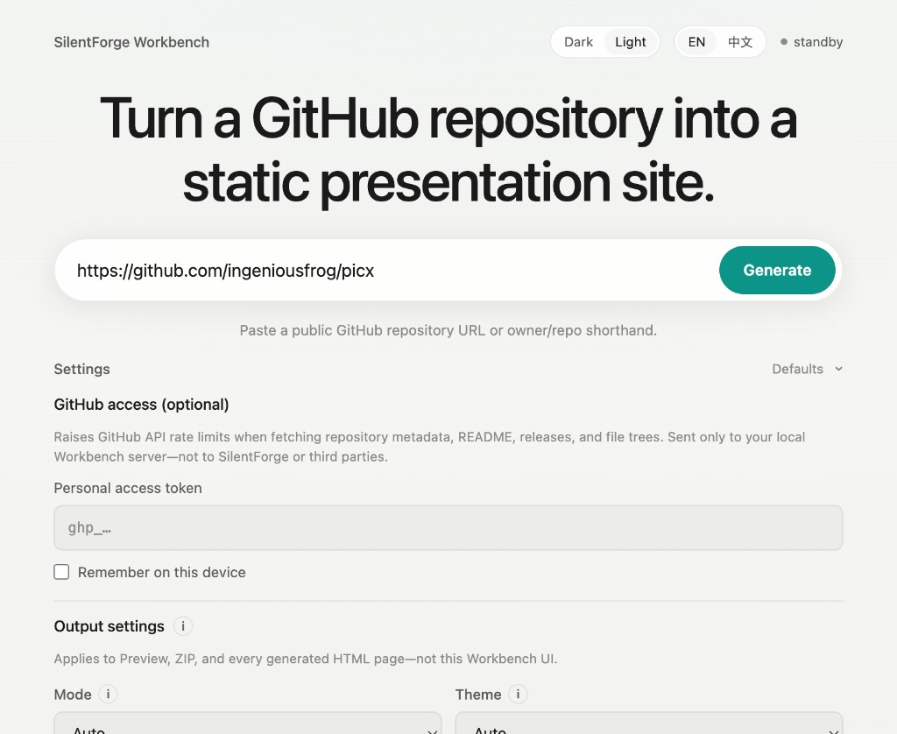
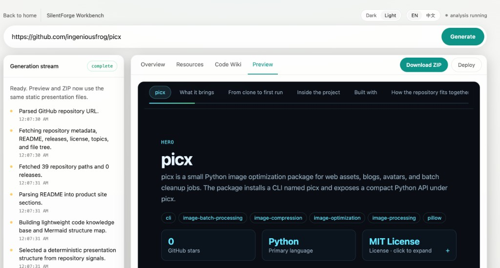
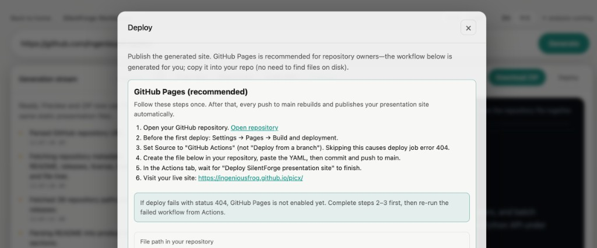
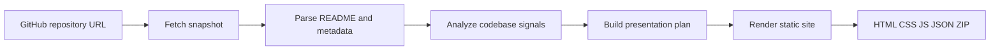

# SilentForge

[](LICENSE)
[](https://nodejs.org/)
[](https://ingeniousfrog.github.io/SilentForge/)

**Transform public GitHub repositories into portable, evidence-backed static presentation sites.**

SilentForge reads README content, metadata, file trees, releases, and lightweight code signals, then emits self-contained HTML you can preview, zip, and deploy anywhere. Use the **`reposite` / `silentforge` CLI** for one-shot generation, or the local **Workbench** for interactive preview and GitHub Pages deployment.

The pipeline is **deterministic and source-bound**—no fabricated sections. Optional OpenAI planning reorders the narrative but every claim traces back to extracted repository data.

[中文文档](./README-CN.md) · **[Live demo](https://ingeniousfrog.github.io/SilentForge/)** — presentation site generated from this repository

---

## Screenshots

| Workbench | Preview & export | Deploy |
|-----------|------------------|--------|
| Paste a repo URL, tune output settings, and generate locally. | Stream generation steps, inspect diagnostics, preview the site, download ZIP. | Copy a GitHub Pages workflow and publish from your repository. |
|  |  |  |

---

## Table of contents

- [Quick start](#quick-start)
- [Usage](#usage)
- [Examples](#examples)
- [Overview](#overview)
- [How it works](#how-it-works)
- [Features](#features)
- [Requirements](#requirements)
- [Installation and distribution](#installation-and-distribution)
- [GitHub authentication](#github-authentication-optional)
- [Workbench](#workbench)
- [CLI reference](#cli-reference)
- [Generated output](#generated-output)
- [Presentation modes and themes](#presentation-modes-and-themes)
- [Internationalization](#internationalization)
- [Environment variables](#environment-variables)
- [Design guarantees](#design-guarantees)
- [FAQ](#faq)
- [Development](#development)
- [License](#license)

---

## Overview

SilentForge targets teams and maintainers who need a **credible, offline-capable project narrative** without standing up a docs platform or hand-authoring a landing page from scratch.

| Surface | Role |
|---------|------|
| **`reposite init`** | One-shot CLI generation to a local directory |
| **Workbench** | Local web UI with live job stream, diagnostics, preview, and ZIP export |
| **Generated site** | Plain HTML / CSS / JS / JSON—editable and hostable anywhere |

Both entry points share the same generation engine, so Preview, ZIP download, and CLI output are structurally identical.

---

## Quick start

Requires **Node.js 20+**. No install step:

```sh
# Generate a static presentation site
npx silentforge init vercel/next.js

# Open the generated index.html (macOS example)
open vercel/next.js-site/index.html

# Launch the local Workbench UI
npx silentforge web
```

Optional local preview after generation:

```sh
npx --yes serve "vercel/next.js-site"
```

---

## Usage

Typical workflows after [Quick start](#quick-start):

```sh
# CLI — generate to a folder and open locally
npx silentforge init owner/repo
open owner/repo-site/index.html    # macOS; adjust path on Linux/Windows

# Workbench — interactive preview, diagnostics, ZIP, deploy guide
npx silentforge web
# → http://127.0.0.1:4177/

# Custom output directory and locale
npx silentforge init owner/repo -o my-site --locale zh

# Optional AI-assisted chapter ordering (requires OPENAI_API_KEY)
OPENAI_API_KEY=sk-… npx silentforge init owner/repo --ai
```

**Publish to GitHub Pages:** generate in Workbench, open **Deploy**, copy the workflow YAML into `.github/workflows/silentforge-pages.yml`, enable **Settings → Pages → GitHub Actions**, then push to `main`. See [Deploy to GitHub Pages](#deploy-to-github-pages).

---

## Examples

Try SilentForge on well-documented public repositories:

| Repository | Best for | Command |
|------------|----------|---------|
| [openai/openai-node](https://github.com/openai/openai-node) | Developer deck (install + usage) | `npx silentforge init openai/openai-node` |
| [vercel/next.js](https://github.com/vercel/next.js) | Architecture signals in a large monorepo | `npx silentforge init vercel/next.js` |
| [tailwindlabs/tailwindcss](https://github.com/tailwindlabs/tailwindcss) | Visual README content | `npx silentforge init tailwindlabs/tailwindcss` |
| [axios/axios](https://github.com/axios/axios) | Compact library narrative | `npx silentforge init axios/axios` |
| [microsoft/playwright](https://github.com/microsoft/playwright) | Docs-heavy project with releases | `npx silentforge init microsoft/playwright` |

See [examples/README.md](./examples/README.md) for more detail.

**Live demo:** [SilentForge on GitHub Pages](https://ingeniousfrog.github.io/SilentForge/) — auto-generated from **this repository** on every push to `main` ([workflow](./.github/workflows/silentforge-pages.yml)). Use it as a reference for what your own repo can look like after deployment.

---

## How it works



1. **Ingest** — Resolve `owner/repo`, fetch repository metadata, README, releases, and file tree via the GitHub API.
2. **Extract** — Parse README structure (features, install, usage, FAQ, screenshots, sections) and derive a lightweight code wiki (stack, entry files, configs, module map, Mermaid diagram).
3. **Diagnose** — Score repository readiness and surface gaps before publication.
4. **Plan** — Select presentation mode, theme, and chapters (rule-based by default; optional OpenAI with schema validation).
5. **Emit** — Write a self-contained static site with scroll-story navigation, detail pages, and bundled Mermaid runtime (no CDN dependency).

---

## Features

- **Scroll-story presentation sites** — sticky chapter navigation, detail routes, three themes (Dark Signal, Editorial Light, Blueprint), five narrative modes or auto-selection from repository signals
- **Code wiki** — detected stack, entry files, config signals, directory summaries, module map, and offline Mermaid architecture diagram
- **Repository diagnostics** — readiness score with strengths, gaps, and recommendations in Workbench **Overview**
- **Local Workbench** — paste a URL, stream generation over SSE, inspect **Overview / Resources / Code Wiki / Preview**, download ZIP, copy GitHub Pages workflow from **Deploy**
- **Source-bound output** — plain HTML, CSS, JS, and JSON; no consumer build step; Preview and ZIP share identical files
- **Internationalization** — Workbench and generated site chrome in EN / 中文; repository facts stay as extracted from the source repo

---

## Requirements

| Requirement | Notes |
|-------------|-------|
| **Node.js 20+** | Required for CLI and Workbench |
| **Public GitHub repository** | `https://github.com/owner/repo` or `owner/repo` shorthand |
| **`GITHUB_TOKEN`** | Optional; recommended for higher API rate limits (CLI env var or Workbench UI) |
| **`OPENAI_API_KEY`** | Optional; enables AI-assisted presentation planning (`--ai` or Workbench checkbox) |

---

## Installation and distribution

### npm (recommended)

```sh
# One-shot generation (no global install)
npx silentforge init owner/repo

# Workbench UI
npx silentforge web

# Global install
npm install -g silentforge
reposite init owner/repo
reposite web
```

The **`reposite`** and **`silentforge`** commands both point to the same CLI entrypoint declared in `package.json`:

```json
"bin": { "reposite": "./dist/cli.js", "silentforge": "./dist/cli.js" }
```

### Build from source

```sh
git clone https://github.com/ingeniousfrog/SilentForge.git
cd SilentForge
npm install
npm run build
```

**Run without installing the global command:**

```sh
# One-shot site generation
node dist/cli.js init openai/openai-node

# Workbench (compiled)
node dist/cli.js web

# Developer loop (TypeScript directly via tsx)
npm run dev -- init openai/openai-node
npm run web
```

**Install `reposite` onto your PATH:**

```sh
npm link          # from the repo root after npm run build
reposite --help
reposite init openai/openai-node
reposite web
```

Alternatively, after `npm run build`:

```sh
npm install -g .
```

### Desktop packaging (DMG / EXE)

Native installers are planned. Until then, distribution is **build-from-source** or **`npm link` / global install** as above. A packaged app will bundle the compiled `dist/` output and launch `reposite web` locally—no separate Node install required on the user's machine.

### Verify the install

```sh
reposite --help
reposite web
# open http://127.0.0.1:4177/
```

Open `<output-dir>/index.html` after `reposite init`, or serve the folder with any static file server.

---

## Deploy to GitHub Pages

SilentForge ships a GitHub Actions workflow that regenerates and publishes a presentation site on every push to `main`.

1. In your repository, go to **Settings → Pages → Build and deployment** and set the source to **GitHub Actions**.
2. Copy [`.github/workflows/silentforge-pages.yml`](./.github/workflows/silentforge-pages.yml) into your repository (or use **Copy GitHub Pages workflow** in Workbench Overview after generating locally).
3. Push to `main` or run the workflow manually from the **Actions** tab.

For this repository, the published site lives at **https://ingeniousfrog.github.io/SilentForge/**.

Other repos can use `npx silentforge@latest init ${{ github.repository }} -o site` inside the workflow (see the template). The SilentForge repository itself builds from source with `npm ci && npm run build` so CI always matches the latest commit.

After Pages is live, add a README badge (also available from Workbench Overview):

```markdown
[](https://YOUR_USER.github.io/YOUR_REPO/)
```

---

## GitHub authentication (optional)

SilentForge reads public repository data through the **GitHub REST API** (metadata, README, releases, file tree). Authentication is optional but recommended: unauthenticated requests share a low hourly limit (~60/hour/IP); an authenticated token raises the limit substantially (~5,000/hour).

The token is used **only** when calling `api.github.com`. It is never sent to OpenAI or any other third party.

| Method | Where | How |
|--------|-------|-----|
| **Workbench UI** | Browser → your local Workbench server | Expand **GitHub access (optional)**, paste a [personal access token](https://github.com/settings/tokens), optionally check **Remember on this device** |
| **`GITHUB_TOKEN` env var** | CLI and Workbench server fallback | `export GITHUB_TOKEN=ghp_…` before `reposite init` or `reposite web` |
| **`--token` flag** | CLI only | `reposite init owner/repo --token ghp_…` |

**Workbench behavior:**

- Token is submitted with the generation job to your **local** server (`POST /api/jobs`).
- It is kept in memory for that job only and is **not** returned by job status APIs.
- If **Remember on this device** is checked, the token is stored in browser `localStorage` (`silentforge.githubToken`) for convenience—useful for personal machines and future desktop builds.
- If the UI field is empty, the server falls back to `process.env.GITHUB_TOKEN` (set when you started Workbench).

For public repositories, a classic PAT with default public read access is sufficient. Fine-grained tokens need **Contents: Read-only** (and **Metadata: Read-only**) on the target repository.

---

## Workbench

Start the local Workbench from source:

```sh
npm run web
```

Open [http://127.0.0.1:4177/](http://127.0.0.1:4177/)

Custom host or port:

```sh
npm run web -- --host 127.0.0.1 --port 4188
```

Run against the compiled CLI entrypoint:

```sh
npm run build && npm run web:dist
```

### Workflow

1. **Appearance** — Toggle **Dark / Light** in the header (defaults to system preference; persisted as `silentforge.uiTheme` after manual selection).
2. **Locale** — Switch **EN / 中文** (persisted as `silentforge.locale`; affects Workbench copy and the next generation job).
3. **GitHub token (optional)** — Expand **GitHub access (optional)** if you hit rate limits or generate frequently. Token stays on your machine; see [GitHub authentication](#github-authentication-optional).
4. **Target** — Paste a public GitHub URL or `owner/repo` shorthand and click **Generate**.
5. **Inspect** — Follow the generation stream; review **Overview**, **Resources**, **Code Wiki**, and **Preview** (opens automatically on completion).
6. **Export** — Download the ZIP or use **Back to home** to start a new target.

### Output settings

Workbench **Output settings** control the **generated site only**—not the Workbench shell:

| Control | Effect |
|---------|--------|
| **Mode** | Narrative structure (`auto`, developer deck, architecture map, visual showcase, compact story) |
| **Theme** | Generated page palette (`auto`, Dark Signal, Editorial Light, Blueprint) |
| **Chapters** | Include or omit section types when matching repository content exists |

Optional **AI-assisted structure** sends extracted repository data to OpenAI for planning. Facts remain source-bound; the pipeline falls back to local rules on failure or validation errors.

---

## CLI reference

### `reposite init <github-repo-url>`

Generate a static presentation site from a repository.

```sh
reposite init https://github.com/openai/openai-node
reposite init openai/openai-node
```

| Option | Description |
|--------|-------------|
| `-o, --output <dir>` | Output directory (default: `<repo-name>-site`) |
| `--ai` | Use OpenAI to arrange evidence-backed structure (falls back to rules on failure) |
| `--mode <mode>` | `auto`, `developer-deck`, `architecture-map`, `visual-showcase`, `compact-story` |
| `--theme <theme>` | `auto`, `signal-dark`, `editorial-light`, `blueprint` |
| `--chapters <kinds>` | Comma-separated chapter kinds (see [Presentation modes and themes](#presentation-modes-and-themes)) |
| `--locale <locale>` | Generated site UI language: `en` (default) or `zh` |
| `--token <token>` | GitHub token (falls back to `GITHUB_TOKEN`) |

Examples:

```sh
# AI-assisted planning
OPENAI_API_KEY=your_key reposite init openai/openai-node --ai

# Explicit presentation options
reposite init openai/openai-node \
  --mode developer-deck \
  --theme signal-dark \
  --chapters features,usage,architecture \
  --locale zh \
  --token "$GITHUB_TOKEN"
```

### `reposite web`

Run the local Workbench server.

```sh
reposite web
reposite web --host 127.0.0.1 --port 4177
```

---

## Generated output

`reposite init` writes a self-contained directory:

| Path | Purpose |
|------|---------|
| `index.html` | Scroll-story entry with sticky chapter navigation |
| `assets/site.css` | Theme-aware presentation styles |
| `assets/site.js` | Chapter navigation, progress tracking, Mermaid bootstrap |
| `assets/mermaid.js` | Bundled Mermaid runtime (offline-capable) |
| `details/*.html` | Installation, usage, architecture, releases, README detail pages |
| `data/site.json` | Structured repository model and final presentation plan |
| `README.md` | Brief note on opening or deploying the generated site |

**Content sources** (never fabricated):

- README: title, summary, features, install/usage, FAQ, screenshots, links, long-form sections
- GitHub metadata: stars, topics, license, releases, default branch, language, homepage
- Code wiki: project structure, stack detection, entry files, config files, module map, Mermaid diagram
- Readiness diagnostics (also visible in Workbench Overview)

---

## Presentation modes and themes

### Modes

| Mode | Best for |
|------|----------|
| `auto` | Let SilentForge infer structure from README, screenshots, and codebase signals |
| `developer-deck` | API/library projects with install and usage emphasis |
| `architecture-map` | Systems with strong structural or module signals |
| `visual-showcase` | Projects with screenshots and visual README content |
| `compact-story` | Minimal narrative for small or early-stage repositories |

### Generated-site themes

| Theme ID | Label | Character |
|----------|-------|-----------|
| `signal-dark` | Dark Signal | Default dark developer-tool palette |
| `editorial-light` | Editorial Light | Light editorial layout with serif headings |
| `blueprint` | Blueprint | Engineering grid background |

Set via Workbench **Output settings** or `--theme` on the CLI. `auto` follows the selected presentation mode.

### Chapter kinds

`features`, `visuals`, `usage`, `readme-insights`, `technology`, `architecture`, `resources`

The hero chapter is always included. Enabled chapters without matching repository content are omitted.

---

## Internationalization

| Surface | Localized? | Mechanism |
|---------|------------|-----------|
| Workbench UI | Yes — EN / 中文 | Header locale capsule (`silentforge.locale`) |
| Workbench appearance | Yes — Dark / Light | Header theme capsule (`silentforge.uiTheme`; system default until overridden) |
| Generated site chrome | Yes — nav, labels, footers, diagnostics | `--locale` / Workbench locale at generation time |
| README and repository facts | **No** | Always shown as extracted from the source repository |

Switching Workbench locale does not retroactively translate past job events; it affects the UI and the next generation run.

---

## Environment variables

| Variable | Purpose |
|----------|---------|
| `GITHUB_TOKEN` | GitHub API authentication when the Workbench UI token field is empty, or for CLI runs without `--token` |
| `OPENAI_API_KEY` | Optional AI presentation planning (`--ai` or Workbench checkbox) |
| `OPENAI_MODEL` | Override OpenAI model (default: `gpt-5.5`) |

Workbench-local preferences (browser `localStorage`, not environment variables): `silentforge.locale`, `silentforge.uiTheme`, `silentforge.githubToken` (when "Remember on this device" is enabled).

---

## Design guarantees

| Principle | Behavior |
|-----------|----------|
| **Source-bound** | Claims trace to extracted repository data |
| **No filler** | Empty sections are omitted, not padded with placeholders |
| **Editable artifacts** | Plain HTML, CSS, JavaScript, and JSON—no proprietary runtime |
| **Single artifact path** | Preview, ZIP, and CLI output share identical files |
| **Local-first** | No hosted build pipeline; runs entirely on your machine |
| **Graceful AI fallback** | Rule-based planning when OpenAI is unavailable or validation fails |

---

## FAQ

### Do I need a GitHub token?

No for occasional public repos. A [personal access token](https://github.com/settings/tokens) helps when you hit API rate limits (~60 requests/hour unauthenticated vs ~5,000/hour authenticated).

### Is the Live demo the official SilentForge website?

It is a **generated presentation site** built from this repository by SilentForge itself—useful as a sample of output, not a separate marketing site.

### Can I deploy to hosts other than GitHub Pages?

Yes. Download the ZIP or upload the output folder to Vercel, Cloudflare Pages, Netlify, or any static host. Workbench **Deploy** includes copy-paste commands.

### Does SilentForge work on private repositories?

The current release targets **public** repositories. Private repo support is planned.

### Will SilentForge invent features not in my README?

No. Sections without repository evidence are omitted. Optional AI may reorder chapters but must cite extracted signals; failures fall back to local rules.

---

## Development

```sh
npm test                 # unit tests
npm run test:coverage    # coverage report
npm run dev -- init owner/repo   # CLI via tsx
npm run web              # Workbench via tsx
```

Project layout (selected):

```
src/
  analyzer/       Codebase signal extraction
  commands/       CLI init command
  github/         Repository snapshot fetching
  i18n/           EN / zh message catalogs
  presentation/   Planning (rules + optional OpenAI)
  readme/         README parsing
  site/           Static site generation
  workbench/      Local server, job store, UI
```

---

## License

Apache-2.0 — see [LICENSE](./LICENSE).
