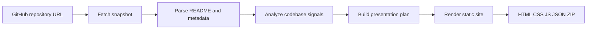

# SilentForge

**Transform public GitHub repositories into portable, evidence-backed static presentation sites.**

SilentForge is a local-first toolchain for turning repository signals—README content, metadata, file trees, releases, and lightweight code analysis—into self-contained HTML you can preview, edit, zip, and deploy to any static host. It ships as the `reposite` CLI and a browser-based **Workbench** for interactive generation.

The default pipeline is **deterministic and source-bound**: it surfaces what the repository actually documents and omits sections without evidence. Optional OpenAI-assisted planning may reorder the narrative, but every claim must trace back to extracted repository data; failures fall back to local rules.

[中文文档](./README-CN.md)

---

## Table of contents

- [Overview](#overview)
- [How it works](#how-it-works)
- [Capabilities](#capabilities)
- [Requirements](#requirements)
- [Installation](#installation)
- [Workbench](#workbench)
- [CLI reference](#cli-reference)
- [Generated output](#generated-output)
- [Presentation modes and themes](#presentation-modes-and-themes)
- [Internationalization](#internationalization)
- [Environment variables](#environment-variables)
- [Design guarantees](#design-guarantees)
- [Development](#development)
- [License](#license)

---

## Overview

SilentForge targets teams and maintainers who need a **credible, offline-capable project narrative** without standing up a docs platform or hand-authoring a landing page from scratch.

| Surface | Role |
|---------|------|
| **`reposite init`** | One-shot CLI generation to a local directory |
| **Workbench** | Local web UI with live job stream, diagnostics, preview, and ZIP export |
| **Generated site** | Plain HTML / CSS / JS / JSON—editable and hostable anywhere |

Both entry points share the same generation engine, so Preview, ZIP download, and CLI output are structurally identical.

---

## How it works



1. **Ingest** — Resolve `owner/repo`, fetch repository metadata, README, releases, and file tree via the GitHub API.
2. **Extract** — Parse README structure (features, install, usage, FAQ, screenshots, sections) and derive a lightweight code wiki (stack, entry files, configs, module map, Mermaid diagram).
3. **Diagnose** — Score repository readiness and surface gaps before publication.
4. **Plan** — Select presentation mode, theme, and chapters (rule-based by default; optional OpenAI with schema validation).
5. **Emit** — Write a self-contained static site with scroll-story navigation, detail pages, and bundled Mermaid runtime (no CDN dependency).

---

## Capabilities

### Presentation layer

- Scroll-story `index.html` with sticky chapter navigation and detail routes
- Three visual themes for generated sites: Dark Signal, Editorial Light, Blueprint
- Five narrative modes: developer deck, architecture handoff, visual showcase, compact story, or auto-selection from repository signals
- Configurable chapter toggles; empty sections are skipped automatically

### Code wiki

- Detected tech stack, entry files, and configuration signals
- Directory summaries, module map, and locally rendered Mermaid architecture diagram
- Source-bound detection—no inferred frameworks or fabricated structure

### Repository diagnostics

- Readiness score with graded strengths, gaps, and actionable recommendations
- Surfaced in Workbench **Overview** before you publish

### Workbench

- Search-first UI: paste a URL, stream generation steps over SSE, inspect results in four tabs
- **Overview** — diagnostics and summary metrics
- **Resources** — parsed README, metadata, and raw signals
- **Code Wiki** — codebase analysis output
- **Preview** — in-browser iframe of the generated site; auto-opens when generation completes
- ZIP download of the exact files shown in Preview
- EN / 中文 locale capsule; Dark / Light Workbench appearance with system `prefers-color-scheme` as the default until overridden

### Output contract

- No build step required on the consumer side—open `index.html` or upload the folder
- Preview and ZIP always reference the same artifact set
- Generated README in the output directory documents deployment options

---

## Requirements

| Requirement | Notes |
|-------------|-------|
| **Node.js 20+** | Required for CLI and Workbench |
| **Public GitHub repository** | `https://github.com/owner/repo` or `owner/repo` shorthand |
| **`GITHUB_TOKEN`** | Optional; recommended for higher API rate limits |
| **`OPENAI_API_KEY`** | Optional; enables AI-assisted presentation planning (`--ai` or Workbench checkbox) |

---

## Installation

```sh
git clone https://github.com/ingeniousfrog/SilentForge.git
cd SilentForge
npm install
npm run build
```

Generate a site from the CLI:

```sh
node dist/cli.js init openai/openai-node
# or, after linking globally:
reposite init openai/openai-node
```

Open `<output-dir>/index.html` in a browser, or serve the directory with any static file server.

---

## Workbench

Start the local Workbench from source:

```sh
npm run web
```

Open [http://127.0.0.1:4177/](http://127.0.0.1:4177/)

Custom host or port:

```sh
npm run web -- --host 127.0.0.1 --port 4188
```

Run against the compiled CLI entrypoint:

```sh
npm run build && npm run web:dist
```

### Workflow

1. **Appearance** — Toggle **Dark / Light** in the header (defaults to system preference; persisted as `silentforge.uiTheme` after manual selection).
2. **Locale** — Switch **EN / 中文** (persisted as `silentforge.locale`; affects Workbench copy and the next generation job).
3. **Target** — Paste a public GitHub URL or `owner/repo` shorthand and click **Generate**.
4. **Inspect** — Follow the generation stream; review **Overview**, **Resources**, **Code Wiki**, and **Preview** (opens automatically on completion).
5. **Export** — Download the ZIP or use **Back to home** to start a new target.

### Output settings

Workbench **Output settings** control the **generated site only**—not the Workbench shell:

| Control | Effect |
|---------|--------|
| **Mode** | Narrative structure (`auto`, developer deck, architecture map, visual showcase, compact story) |
| **Theme** | Generated page palette (`auto`, Dark Signal, Editorial Light, Blueprint) |
| **Chapters** | Include or omit section types when matching repository content exists |

Optional **AI-assisted structure** sends extracted repository data to OpenAI for planning. Facts remain source-bound; the pipeline falls back to local rules on failure or validation errors.

---

## CLI reference

### `reposite init <github-repo-url>`

Generate a static presentation site from a repository.

```sh
reposite init https://github.com/openai/openai-node
reposite init openai/openai-node
```

| Option | Description |
|--------|-------------|
| `-o, --output <dir>` | Output directory (default: `<repo-name>-site`) |
| `--ai` | Use OpenAI to arrange evidence-backed structure (falls back to rules on failure) |
| `--mode <mode>` | `auto`, `developer-deck`, `architecture-map`, `visual-showcase`, `compact-story` |
| `--theme <theme>` | `auto`, `signal-dark`, `editorial-light`, `blueprint` |
| `--chapters <kinds>` | Comma-separated chapter kinds (see [Presentation modes and themes](#presentation-modes-and-themes)) |
| `--locale <locale>` | Generated site UI language: `en` (default) or `zh` |
| `--token <token>` | GitHub token (falls back to `GITHUB_TOKEN`) |

Examples:

```sh
# AI-assisted planning
OPENAI_API_KEY=your_key reposite init openai/openai-node --ai

# Explicit presentation options
reposite init openai/openai-node \
  --mode developer-deck \
  --theme signal-dark \
  --chapters features,usage,architecture \
  --locale zh \
  --token "$GITHUB_TOKEN"
```

### `reposite web`

Run the local Workbench server.

```sh
reposite web
reposite web --host 127.0.0.1 --port 4177
```

---

## Generated output

`reposite init` writes a self-contained directory:

| Path | Purpose |
|------|---------|
| `index.html` | Scroll-story entry with sticky chapter navigation |
| `assets/site.css` | Theme-aware presentation styles |
| `assets/site.js` | Chapter navigation, progress tracking, Mermaid bootstrap |
| `assets/mermaid.js` | Bundled Mermaid runtime (offline-capable) |
| `details/*.html` | Installation, usage, architecture, releases, README detail pages |
| `data/site.json` | Structured repository model and final presentation plan |
| `README.md` | Brief note on opening or deploying the generated site |

**Content sources** (never fabricated):

- README: title, summary, features, install/usage, FAQ, screenshots, links, long-form sections
- GitHub metadata: stars, topics, license, releases, default branch, language, homepage
- Code wiki: project structure, stack detection, entry files, config files, module map, Mermaid diagram
- Readiness diagnostics (also visible in Workbench Overview)

---

## Presentation modes and themes

### Modes

| Mode | Best for |
|------|----------|
| `auto` | Let SilentForge infer structure from README, screenshots, and codebase signals |
| `developer-deck` | API/library projects with install and usage emphasis |
| `architecture-map` | Systems with strong structural or module signals |
| `visual-showcase` | Projects with screenshots and visual README content |
| `compact-story` | Minimal narrative for small or early-stage repositories |

### Generated-site themes

| Theme ID | Label | Character |
|----------|-------|-----------|
| `signal-dark` | Dark Signal | Default dark developer-tool palette |
| `editorial-light` | Editorial Light | Light editorial layout with serif headings |
| `blueprint` | Blueprint | Engineering grid background |

Set via Workbench **Output settings** or `--theme` on the CLI. `auto` follows the selected presentation mode.

### Chapter kinds

`features`, `visuals`, `usage`, `readme-insights`, `technology`, `architecture`, `resources`

The hero chapter is always included. Enabled chapters without matching repository content are omitted.

---

## Internationalization

| Surface | Localized? | Mechanism |
|---------|------------|-----------|
| Workbench UI | Yes — EN / 中文 | Header locale capsule (`silentforge.locale`) |
| Workbench appearance | Yes — Dark / Light | Header theme capsule (`silentforge.uiTheme`; system default until overridden) |
| Generated site chrome | Yes — nav, labels, footers, diagnostics | `--locale` / Workbench locale at generation time |
| README and repository facts | **No** | Always shown as extracted from the source repository |

Switching Workbench locale does not retroactively translate past job events; it affects the UI and the next generation run.

---

## Environment variables

| Variable | Purpose |
|----------|---------|
| `GITHUB_TOKEN` | GitHub API authentication and rate-limit headroom |
| `OPENAI_API_KEY` | Optional AI presentation planning (`--ai` or Workbench checkbox) |
| `OPENAI_MODEL` | Override OpenAI model (default: `gpt-5.5`) |

---

## Design guarantees

| Principle | Behavior |
|-----------|----------|
| **Source-bound** | Claims trace to extracted repository data |
| **No filler** | Empty sections are omitted, not padded with placeholders |
| **Editable artifacts** | Plain HTML, CSS, JavaScript, and JSON—no proprietary runtime |
| **Single artifact path** | Preview, ZIP, and CLI output share identical files |
| **Local-first** | No hosted build pipeline; runs entirely on your machine |
| **Graceful AI fallback** | Rule-based planning when OpenAI is unavailable or validation fails |

---

## Development

```sh
npm test                 # unit tests
npm run test:coverage    # coverage report
npm run dev -- init owner/repo   # CLI via tsx
npm run web              # Workbench via tsx
```

Project layout (selected):

```
src/
  analyzer/       Codebase signal extraction
  commands/       CLI init command
  github/         Repository snapshot fetching
  i18n/           EN / zh message catalogs
  presentation/   Planning (rules + optional OpenAI)
  readme/         README parsing
  site/           Static site generation
  workbench/      Local server, job store, UI
```

---

## License

Apache-2.0 — see [LICENSE](./LICENSE).
